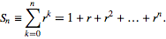
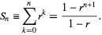

Binary Search
=============
In computer science, binary search, also known as half-interval search or
logarithmic search, is a search algorithm that finds the position of a
target value within a sorted array. It works by comparing the target
value to the middle element of the array; if they are unequal, the lower or
upper half of the array is eliminated depending on the result and the search is
repeated in the remaining subarray until it is successful.

Procedure
---------
Given an array A of n elements with values or records A(0)...A(n−1) and target
value T, the following subroutine uses binary search to find the index of T 
in A.

Pseudo Code::

    Step 1: Set L to 0 and R to n − 1.
    Step 2: If L > R, the search terminates as unsuccessful. 
    Step 3: Set m (the position of the middle element) to the floor of
            (L + R) / 2.
    Step 4: If A(m) < T, set L to m + 1 and go to step 2.
    Step 5: If A(m) > T, set R to m − 1 and go to step 2.
    Step 6: If A(m) = T, the search is done; return m.

Implementation
--------------
The following is a basic binary search function written in python

.. code:: python

    def binary_search(array, target):
        """ Performs Binary Search on an array of integers by finding the
        target number or return -1 if the target number is not found """

        left, right = 0, len(array) - 1
        while True:
            if left > right:
                return -1
            middle = (left + right) // 2
            if array[middle] < target:
                left = middle + 1
            elif array[middle] > target:
                right = middle - 1
            else:
                return middle

Lets run through a few examples and see how the algorithm actually works.

Example #1 where the target is in the right half of the array

Initial parameters::

    Given: [1, 3, 10, 20, 23, 50] and 23

We begin the procedure by setting the value for L to 0, R to 5 (length of the
array is 6 and 6 - 1 is 5) and M to 2 ( taking the floor of (0 + 5)/2 which
gives us 2) [Step 1] and begin our iteration over Steps 2 - 6. Since
0(L) < 2(R we continue to Step 3 and assign M the value of 2. Steps 1, 2 and
3 will be omitted from all subsequent examples as the author finds copying these
lines laborious and redundant to repeat.

Loop 1::

    start
           L(0)  M(2)
           ↓     ↓
          [1, 3, 10, 20, 23, 50]
                         ↑
                         R(5)
    end

Array value at A(2) is 10 and 10 < 23, we increment L [Step 4] by M + 1 and 
continue onto the next loop. Returning to Step 2 in algorithm execution.

Loop 2::

                     L(3) M(4)
                     ↓    ↓
          [1, 3, 10, 20, 23, 50]
                          ↑
                          R(5)

Array value at A(4) is 23 and 23 is the number we are looking for enabling us
to terminate the procedure by returning [Step 6] 4 as the index at which the
value exists.

Example #2 where the target at the end the array

Initial parameters::

    Given: [1, 3, 10, 20, 23, 50] and 50

Loop 1::

           L(0)  M(2)
           ↓     ↓
          [1, 3, 10, 20, 23, 50]
                         ↑
                         R(5)

Array value at A(2) is 10 and 10 < 50, we set the value of L [Step 4] to M + 1
and continue onto the next loop. Returning to Step 2 in algorithm execution.

Loop 2::

                     L(3) M(4)
                     ↓    ↓
          [1, 3, 10, 20,  23, 50]
                          ↑
                          R(5)

Array value at A(4) is 23 and 23 < 50, we set the value of L [Step 4] to M + 1
and continue onto the next loop. Returning to Step 2 in algorithm execution.

Loop 3::

                             M(5)
                             L(5)
                             ↓
          [1, 3, 10, 20, 23, 50]
                          ↑
                          R(5)

At this point Step 2 should be mentioned as the condition `<` will not
terminate the loop simply because 5 is not greater than 5. So we continue to the
next step. Array value at A(5) is 50 and 50 is the number we are looking for
enabling us to terminate the procedure by returning [Step 6] 5 as the index at
which the value exists.

Example #3 where the target is in the beginning the array

Initial parameters::

    Given: [1, 3, 10, 20, 23, 50] and 1

Loop 1::

           L(0)  M(2)
           ↓     ↓
          [1, 3, 10, 20, 23, 50]
                         ↑
                         R(5)

Array value at A(2) is 10 and 10 > 1, we set the value of R [Step 5] to M - 1
and continue onto the next loop. Returning to Step 2 in algorithm execution.

Loop 2::

           M(0)
           L(0)
           ↓
          [1, 3, 10, 20, 23, 50]
              ↑
              R(1)

The value for M is set to zero because::

    (L + R)   (0 + 1)    1
    ------- = ------- = ---, after taking the floor(0.5) we get 0
       2         2       2

Array value at A(0) is 1 and 1 is the number we are looking for enabling us to
terminate the procedure by returning [Step 6] 5 as the index at which the value
exists.

Example #4 where the target is in the left half the array

Initial parameters::

    Given: [1, 3, 10, 20, 23, 50] and 3

Loop 1::

           L(0)  M(2)
           ↓     ↓
          [1, 3, 10, 20, 23, 50]
                         ↑
                         R(5)

Array value at A(2) is 10 and 10 < 3, we set the value of R [Step 5] to M - 1
and continue onto the next loop. Returning to Step 2 in algorithm execution.

Loop 2::

           M(0)
           L(0)
           ↓
          [1, 3, 10, 20, 23, 50]
              ↑
              R(1)

Array value at A(0) is 1 and 1 > 3, we set the value of L [Step 4] to M + 1
and continue onto the next loop. Returning to Step 2 in algorithm execution.

Loop 3::

              M(1)
              L(1)
              ↓
          [1, 3, 10, 20, 23, 50]
              ↑
              R(1)

Array value at A(1) is 3 and 3 is the number we are looking for enabling us to
terminate the procedure by returning [Step 6] 5 as the index at which the value
exists.

Analysis
--------

You can think of the algorithm as creating a binary tree when its searching
for targets. For instance given the following::

    Given: [1, 3, 10, 20, 23, 50] and 23

We can then translate the array into possible paths the binary search can
perform when looking for a specific target::

        10
       /  \
      3    23
     / \   / \
    1     20 50

So at worst our algorithm can perform 3 (in the current example)
comparisons to find a specific target. This insight will enable us to generalize
the algorithm run time given any array of sorted integers.

But before we begin, let's introduce/review a few concepts which will become
useful to proving our conjecture.

First remember/note the depth property of a Tree data structure::

        10        depth = 0, 2^0 and at depth we could have 1 node
       /  \
      3    23     depth = 1, 2^1 and at depth we could have 2 nodes
     / \   / \
    1     20 50   depth = 2, 2^2 and at depth we could have 4 nodes

At any given depth we can count the maximum number of nodes. By raising 2
to the power of the depth level, assuming every node is filled in, we know the
maximum number of nodes at that depth. Which is not the case in our example.
However that can be overlooked since we're trying to find the worst case. And
even on average where some paths are empty we're still approaching this maximum
limit. 

A binary tree which exhibits this property is called a full binary tree.

Full Binary Tree
  A full binary tree (sometimes proper binary tree or 2-tree) is a tree in
  which every node other than the leaves has two children.

Our goal is to be able to measure a given array of integers and its resultant
search tree for all/some of the longest paths the algorithm will have to
traverse to find an answer.

We can begin by finding a total number of nodes by adding together the number
of nodes at each depth::

  2^0 + 2^1 + 2^2 + 2^3 + ... + 2^d

However doing this by hand may prove to be impractical and we know of a
general solution to the summation by remembering infinite series from
Calculus

By plugging in 2 for the value of r we get the following formula::

   1 - 2^(n+1)
  -------------
      1 - 2

Which can be reduced to a single equation by the following steps::

  (1)       1 - 2^(n+1)
           -------------
                -1

  (2)     (-1) * (1 - 2^(n+1))

  (3)     -1 + 2^(n+1)

  (4)     2^(n+1) - 1

The equation from above gives us a way for find the possible number of nodes
in a full binary tree (We will substitute n for d from this point forward.
Because n in the above formula represents the depth of the tree)::

  n = 2^(d + 1) - 1

Using this formula we can solve for d (depth) which enables us to find the
longest path to finding a target or to put this another way how long will it
take for binary search to find something in an array of length n!

Let's solve the equation for d::

  (1)   n = 2^(d + 1) - 1

  (2)   n + 1 = 2^(d + 1)

  (3)   log(n + 1) = log(2^(d + 1))

  (4)   log(n + 1) = (d + 1) * log(2), Note log(2) = 1 in base 2 system, so we
                                       can multiply it in

  (5)   log(n + 1) = d + 1

  (6)   log(n + 1) - 1 = d

  (7)   d = log(n + 1) - 1

Therefore at most the binary search will make::

  log(n + 1) - 1

comparisons before finding a match!

Properties
----------

The following table describes the limiting behavior of the algorithm when the
argument tend(s) towards a particular value or infinity

+---------+------------------+
| Case    |  Time Complexity |
+=========+==================+
| Best    |  O(1)            |
+---------+------------------+
| Average |  O(log n)        |
+---------+------------------+
| Worst   |  O(log n)        |
+---------+------------------+

